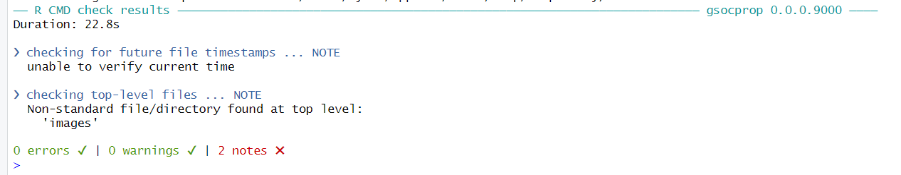
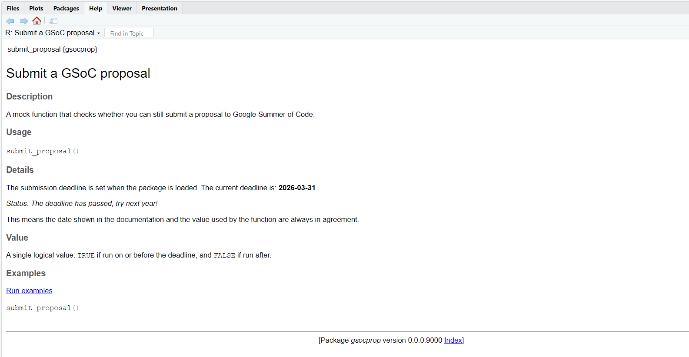
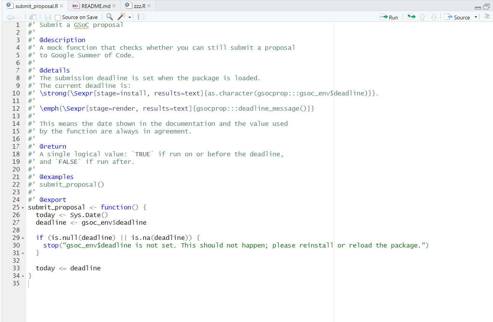

# gsocprop

`gsocprop` is a small R package I created for the **GSoC 2026** test task for\
“Multilingual documentation of R packages”.

The package focuses on a single function, `submit_proposal()`, which checks whether you can still submit a Google Summer of Code proposal based on a fixed annual deadline. The implementation covers all three qualification levels (easy, medium, and hard), and demonstrates:

-   basic R package structure,
-   roxygen2 documentation,
-   dynamic Rd documentation using `\Sexpr`,
-   and the use of a package-scoped environment to keep code and docs in sync.

## Tests completed

### Easy test

-   Implemented `submit_proposal()` with **no arguments**.
-   Returns `TRUE` if run on or before the deadline, `FALSE` otherwise.
-   Uses base R (`Sys.Date()`, `as.Date()`) for date comparison.

### Medium test

-   Documented `submit_proposal()` with **roxygen2**:
    -   title, description, details, value, and examples.
-   Stores the submission deadline once in a package environment `gsoc_env$deadline`.
-   Function code reads the deadline from this global variable instead of hard-coding it.

### Hard test

-   Deadline in the help page is **not hard-coded** in the `.Rd` file.
-   Documentation uses Rd `\Sexpr` to:
    -   fetch the deadline from `gsoc_env$deadline` at install/load time, and
    -   compute a status message (“The deadline is in X days.” / “The deadline has passed, try next year!”) whenever the user runs `?submit_proposal`.
-   The value used by the function and the information shown in the help always come from the same source.

### R CMD check

`devtools::check()` for `gsocprop` completes with no errors or warnings:



## Installation

You can install the development version from GitHub:

``` r
# install.packages("remotes")
remotes::install_github("mahjabinoyshi/gsocprop")

library(gsocprop)
```

## Usage

Load the package and call `submit_proposal()`:

``` r
library(gsocprop)

submit_proposal()
#> TRUE or FALSE, depending on today's date and the configured deadline
```

You can also inspect the help page:

``` r
?submit_proposal
```

Here is what the help page looks like in RStudio:



The help shows:

-   the current deadline date (fetched from the package environment), and
-   a status message computed at documentation render time, for example:
    -   “Status: The deadline is in 3 days.”
    -   “Status: The deadline is today! Submit immediately.”
    -   “Status: The deadline has passed, try next year!”

## How it works

Internally, the package uses a small environment `gsoc_env` to store the submission deadline:

-   `R/zzz.R` defines `gsoc_env` and an `.onLoad()` hook.
-   When the package is loaded, `.onLoad()` computes the deadline (e.g. March 31 of the current year) and assigns it to `gsoc_env$deadline`.

The function `submit_proposal()` is intentionally simple:

``` r
submit_proposal()
# 1. Reads today's date via Sys.Date()
# 2. Reads the deadline from gsoc_env$deadline
# 3. Returns TRUE if today <= deadline, FALSE otherwise
```

Below is a screenshot from RStudio showing the function and the documentation workflow:



The documentation uses dynamic Rd expressions:

-   A `\Sexpr[stage=install]` call inserts the actual deadline date from `gsoc_env$deadline` when the package is installed.
-   A `\Sexpr[stage=render]` call invokes an internal helper `deadline_message()` to compute a human-readable status string each time the help page is rendered.

This makes the help page and the function behavior always agree, without re-running `devtools::document()` every time the deadline changes.

## GSoC project context

This package was created as part of my preparation for the GSoC 2026 project:

-   **Project**: Multilingual documentation of R packages\
-   **Wiki**: <https://github.com/rstats-gsoc/gsoc2026/wiki/Multilingual-documentation-of-R-packages>\
-   **Mentors**: Heather Turner, Elio Campitelli

The goal of `gsocprop` is to demonstrate that I can work comfortably with R package development, roxygen2, and dynamic documentation techniques that will be useful for multilingual Rd tooling.
